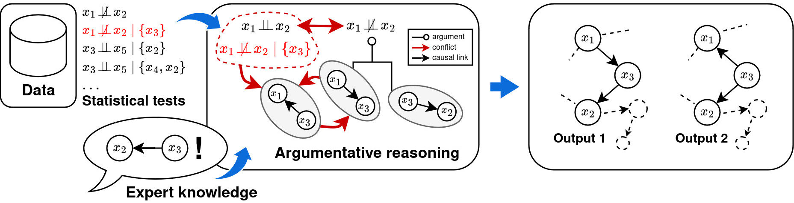

# Argumentative Causal Discovery
This repository provides the code for the paper "Argumentative Causal Discovery". 

In this paper we propose Causal ABA, which combines statistical tests and expert domain knowledge with non-monotonic reasoning and performs argumentative reasoning to output causal graphs in accordance with the reported causal relationships. Below is an overview of the workflow.



We instantiate Causal ABA using the conditional independence tests from the Majority-PC algorithm [(Colombo and Maathuis, 2014)](https://jmlr.org/papers/v15/colombo14a.html) as input, resulting in ABA-PC, a practical Causal Discovery algorithm that, in our experiments, is competitive with state-of-the-art baselines.
### Reproduce Experiments
The experiments in the paper can be reproduced by running ```python experiments_bnlearn.py``` from the root folder. All the plots included in the paper can be inspected interactively from the [results/figs](results/figs) folder. Just download them and open them in a browser. 

A jupyter notebook collecting the stored results and producing the plots in the paper is provided [here](notebooks/Experiments.ipynb).

### Causal ABA
Causal ABA is the main function of the repository, provided in ```causalaba.py```. This is a python wrapper around an ASP encoding provided in [causalaba.lp](encodings/causalaba.lp).

### ABA-PC
The file ```abapc.py``` hosts the wrapper function around Causal ABA, and runs Majority-PC to retrieve the independence tests used as facts, weights them and selects the strongest output extension output of ```causalABA()```.

### Example usage
To run the ABAPC directly from python at the root folder, run:
```
import networkx as nx
import numpy as np
import pandas as pd
from utils.data_utils import simulate_discrete_data
from abapc import ABAPC

## True Adjacency matrix
B_true = np.array( [[ 0,  0,  1,  0],
                    [ 0,  0,  1,  1],
                    [ 0,  0,  0,  1],
                    [ 0,  0,  0,  0]])
n_nodes = B_true.shape[0]
expected = {(0, 2), (1, 2), (1, 3), (2, 3)}
G_true = nx.DiGraph(pd.DataFrame(B_true, columns=[f"X{i+1}" for i in range(B_true.shape[1])], index=[f"X{i+1}" for i in range(B_true.shape[1])]))
truth_DAG_directed_edges = set([(int(e[0].replace("X",""))-1,int(e[1].replace("X",""))-1)for e in G_true.edges])
## Simulate data 
data = simulate_discrete_data(n_nodes, 10000, truth_DAG_directed_edges, 2376)
## ABAPC
B_est = ABAPC(data=data, alpha=0.05, indep_test='fisherz', scenario='test', 
                set_indep_facts=False, stable=True, conservative=True)
## Edges from adjacency matrix
est_edges = set([(i,j) for i in range(n_nodes) for j in range(n_nodes) if B_est[i,j]==1])

print(f"Expected edges: {expected}")
print(f"Edges from ABAPC: {est_edges}")

OUTPUT:
>>> Expected edges: {(2, 3), (0, 2), (1, 2), (1, 3)}
>>> Edges from ABAPC: {(2, 3), (0, 2), (1, 2), (1, 3)}
```
ABAPC is integrated in the ```run_method()``` function together with the baselines used in the paper in [models.py](https://github.com/briziorusso/ArgCausalDisco/blob/main/abapc.py).

### Environment
The code was tested with Python 3.10. `requirements.txt` provides the necessary python packages. Run `pip install -r requirements.txt` from a terminal at the root folder to install all packages in your virtual environment. You will need clingo 5.6.2 installed from the potassco repository via conda (command provided in requirements.txt).


### Reference
If you are using this code, please cite our paper
```
@inproceedings{KR2024-88,
    title     = {{Argumentative Causal Discovery}},
    author    = {Russo, Fabrizio and Rapberger, Anna and Toni, Francesca},
    booktitle = {{Proceedings of the 21st International Conference on Principles of Knowledge Representation and Reasoning}},
    pages     = {938--949},
    year      = {2024},
    month     = {8},
    doi       = {10.24963/kr.2024/88},
    url       = {https://doi.org/10.24963/kr.2024/88},
  }
```
