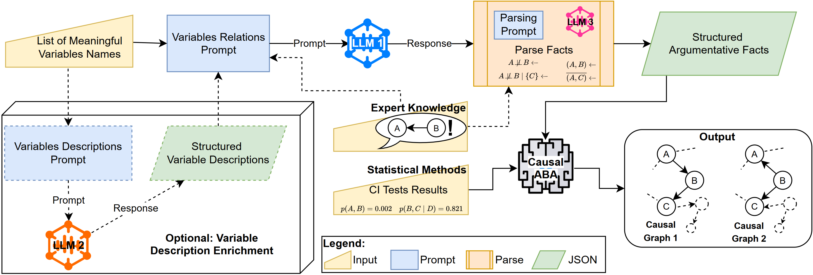
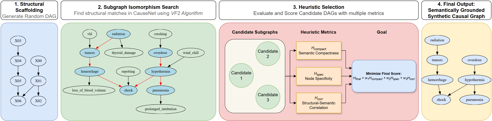

# ArgCausalDisco: LLM-Augmented Causal ABA

This branch provides the code and reproducibility artifacts for the UAI 2026 paper:

**Leveraging Large Language Models for Causal Discovery: a Constraint-based, Argumentation-driven Approach**
Zihao Li and Fabrizio Russo, Imperial College London.

The paper extends Causal Assumption-Based Argumentation (Causal ABA) with semantic constraints elicited from large language models. The resulting ABAPC-LLM pipeline treats LLMs as imperfect experts: variable names and optional descriptions are used to elicit required and forbidden causal directions, repeated LLM calls are consensus-filtered for precision, and the surviving constraints are integrated with data-derived conditional-independence evidence through Causal ABA.

## LLM Integration



The LLM pipeline is implemented around the `priors/` package and the experiment runners. LLM responses are parsed into structured `required` and `forbidden` arrow constraints, aggregated into consensus priors, and supplied to the prior-aware Causal ABA and MPC variants.

The statistical side of the UAI experiments uses Wilks G2 conditional-independence tests with `alpha=0.01`.

The baselines analysed in the paper are Random, FGS, NOTEARS-MLP, GRaSP, BOSS, MPC, MPC-LLM, ABAPC, LLM-BFS, and ABAPC-LLM.

## CauseNet Synthetic Data



The synthetic benchmark grounds randomly generated DAG structures in `CauseNet`, producing semantically meaningful variables while avoiding direct reuse of standard public benchmark graphs. The local generator app is in:

```text
synthetic_graph_demo/
```

Run it locally with:

```bash
cd synthetic_graph_demo
pip install -r requirements.txt
uvicorn main:app --host 0.0.0.0 --port 8000
```

The hosted version is available at: https://clarg-group.github.io/CauseNet-graph-generator/

## Repository Layout

- `causalaba.py`: Python wrapper around the ASP encoding in `encodings/causalaba.lp`.
- `abapc.py`: ABAPC wrapper that obtains CI facts, ranks them, and calls Causal ABA.
- `experiment_llm.py`: ABAPC/ABAPC-LLM experiment runner with per-dataset checkpointing.
- `experiments.py`: unified runner for MPC, MPC-LLM, BOSS, GRaSP, NOTEARS, FGS, random baselines, and other models.
- `priors/`: prompts, schemas, LLM parsing, and prior utilities.
- `scripts/run_llm_priors.py`: scripted LLM prior generation and consensus aggregation.
- `scripts/paper_tables.py`: paper-table formatter for collected result files.
- `scripts/export_bfs_result.py`: exports Causal-LLM-BFS results into paper CSV format.
- `notebooks/`: analysis notebooks for priors, plots, ablations, and paper figures.
- `synthetic/`, `bnlearn/`, `datasets/bayesian/`: BIFXML/BIF datasets used by the experiments.
- `results/`: compact summaries, consensus priors, tables, and tracked paper artifacts.

## Reproducing The Paper

Detailed commands for the UAI 2026 experiments are in:

```text
docs/uai26_experiments.md
```

The guide for collecting final plots and tables after the runs is in:

```text
docs/uai26_collect_results.md
```

At a high level:

1. Configure the LLM provider and generate consensus priors with `scripts/run_llm_priors.py` or `notebooks/priors_assessments.ipynb`.
2. Run statistical and prior-aware baselines with `experiments.py`.
3. Run ABAPC and ABAPC-LLM with `experiment_llm.py`.
4. Export Causal-LLM-BFS outputs with `scripts/export_bfs_result.py`.
5. Generate tables with `scripts/paper_tables.py`.
6. Execute the notebooks in `notebooks/` to produce figures.

## Environment

The branch was developed in the `aba-env` environment used for the experiments. Install the Python dependencies from:

```bash
pip install -r requirements.txt
```

The Causal ABA solver requires `clingo`. Some baselines require optional dependencies, including `causal-learn`, `pyAgrum`, NOTEARS/Castle tooling, CDT, and R packages for SID/CAM-related functionality.

## Reference

If you use this branch, please cite:

```bibtex
@inproceedings{li2026llmcausalaba,
  title     = {Leveraging Large Language Models for Causal Discovery: a Constraint-based, Argumentation-driven Approach},
  author    = {Li, Zihao and Russo, Fabrizio},
  booktitle = {Proceedings of the Conference on Uncertainty in Artificial Intelligence (UAI)},
  year      = {2026}
}
```

This work builds on the original Causal ABA framework:

```bibtex
@inproceedings{KR2024-88,
  title     = {{Argumentative Causal Discovery}},
  author    = {Russo, Fabrizio and Rapberger, Anna and Toni, Francesca},
  booktitle = {{Proceedings of the 21st International Conference on Principles of Knowledge Representation and Reasoning}},
  pages     = {938--949},
  year      = {2024},
  doi       = {10.24963/kr.2024/88},
  url       = {https://doi.org/10.24963/kr.2024/88}
}
```
